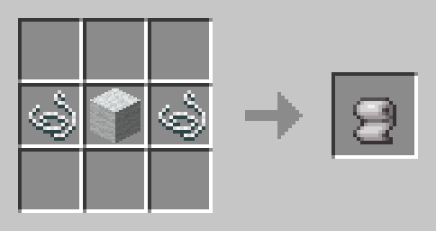
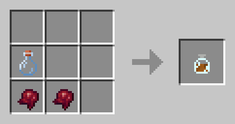
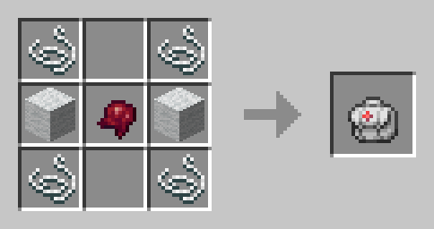

# Body Health System

This mod adds a new heath system to Minecraft.
Players health is splitted in different body parts, when a part receives damage only the armor corresponding to that part is taken in consideration.
If some parts lose all the health debuffs will be applied to the player, as slowness, mining fatigue and weakness.

## TODO

- Ray cast arrows to apply the damage to a specific part.
- HUD configuration.
- Better GUI.
- Add custom Damage Distributions for each mob.
- Create an API and code revision.
- Multiplayer healing.

## Crafting

### Plaster

### Morphine

### Medkit

## Contributing
TODO but you can check the [UML diagram](https://github.com/SrGnis/Body-Health-System/blob/master/docs/images/BodyHealthSystemUML.png)
